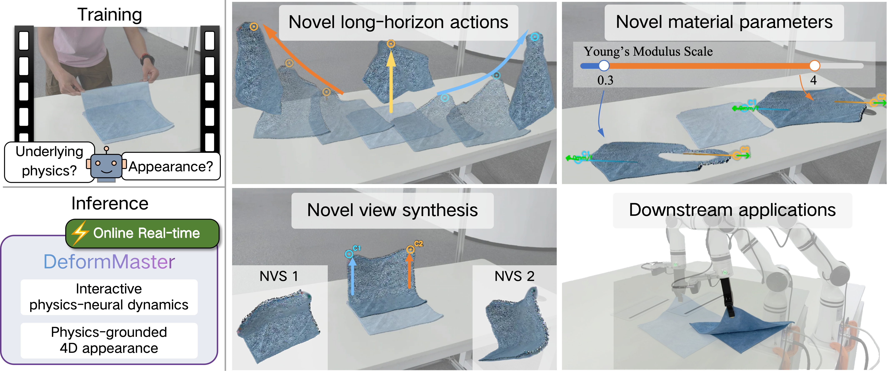
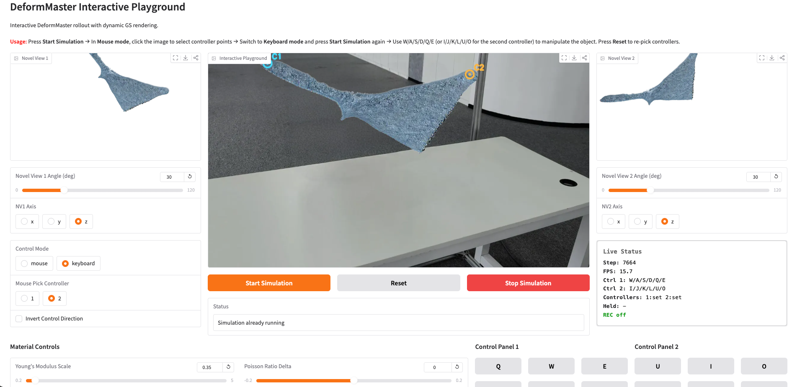

# DeformMaster: An Interactive Physics-Neural World Model for Deformable Objects from Videos

[Project page](https://can-lee.github.io/deformmaster-web/) · [arXiv](https://arxiv.org/abs/2605.09586) · Hugging Face (coming)



## Release plan

- [x] inference code
- [x] playground code
- [ ] checkpoints
- [ ] training code
- [ ] custom data and preprocessing code
- [ ] full configurations

## Installation

```bash
# 1. Python env (Python 3.10 + PyTorch 2.4.0 + CUDA 12.1 / 12.4 tested)
conda create -n deformmaster python=3.10 -y
conda activate deformmaster

# 2. Install Python deps + CUDA rasterizer submodules
bash install.sh
```

## Inference

```bash
# Example: planar (cloth)
python inference.py --case_name my_mono_cloth --config configs/planar.yaml
```

## Interactive playground



```bash
python playground.py \
    --case_name my_mono_cloth \
    --output ./checkpoints \
    --base_path ./data \
    --gaussian_path ./checkpoints/gaussian \
    --server_port 7860
```


## Citation

```bibtex
@article{li2026deformmaster,
      title={DeformMaster: An Interactive Physics-Neural World Model for Deformable Objects from Videos},
      author={Can Li and Zhoujian Li and Ren Li and Jie Gu and Lei Lei and Jingmin Chen and Lei Sun},
      year={2026},
      eprint={2605.09586},
      archivePrefix={arXiv},
      primaryClass={cs.CV},
      url={https://arxiv.org/abs/2605.09586},
}
```

## Acknowledgements

We thank the authors of [PhysTwin](https://jianghanxiao.github.io/phystwin-web/), [PGND](https://kywind.github.io/pgnd), and [3D Gaussian Splatting](https://github.com/graphdeco-inria/gaussian-splatting).
