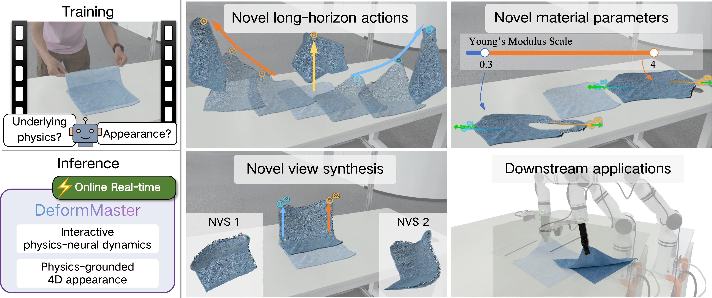
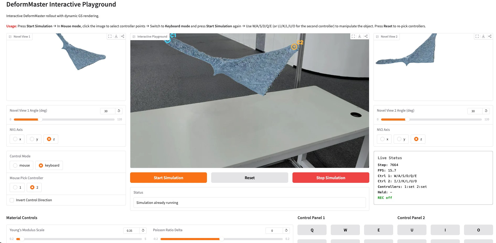

# DeformMaster: An Interactive Physics-Neural World Model for Deformable Objects from Videos

[](https://can-lee.github.io/deformmaster-web/)
[](https://arxiv.org/abs/2605.09586)
[](https://huggingface.co/datasets/Canlee/DeformMaster-Assets)



## Release Status

- [x] **[2026/05/20]** Inference code
- [x] **[2026/05/20]** Online interaction code
- [x] **[2026/07/07]** Demo data and checkpoints
- [x] **[2026/07/07]** Interactive playground demo
- [x] **[2026/07/07]** Data preprocessing code
- [ ] Full training code
- [ ] Downstream embodied application

## 1. Environment

Create and activate the DeformMaster conda environment:

```bash
conda create -y -n deformmaster python=3.10
conda activate deformmaster

# Optional: set CUDA_HOME if nvcc is not already available.
# export CUDA_HOME=/path/to/cuda
# export PATH="${CUDA_HOME}/bin:${PATH}"
# export LD_LIBRARY_PATH="${CUDA_HOME}/lib64:${LD_LIBRARY_PATH}"
```

Install the DeformMaster dependencies. If you only want to explore the
interactive playground, you can skip dependencies for data processing by using
`SKIP_OPT=1`:

```bash
SKIP_OPT=1 bash ./env_install/env_install.sh

pip install gradio==6.2.0 fastapi uvicorn
python -c "import torch, warp, gradio; print('env OK', torch.__version__)"
```

For full data processing dependencies, run `bash ./env_install/env_install.sh`
without `SKIP_OPT=1`.

## 2. Run The Online Demo

The current interactive demo is `interactive_playground_online.py`.



Download `playground_assets.zip` (ckpt and data) from the [DeformMaster-Assets](https://huggingface.co/datasets/Canlee/DeformMaster-Assets) page into the repository root and unzip it:

```bash
unzip playground_assets.zip
```

The archive expands directly into:

```text
data/
outputs/
gaussian_output/
MANIFEST.txt
```

Run the monocular-cloth demo:

```bash
CUDA_VISIBLE_DEVICES=<gpu_id> python interactive_playground_online.py \
    --case_name my_mono_cloth \
    --output outputs/output_mono
```

Run the softbody demo:

```bash
CUDA_VISIBLE_DEVICES=<gpu_id> python interactive_playground_online.py \
    --case_name double_lift_sloth \
    --output outputs/output_ours
```

If the port is busy, the script picks the next free port and prints the URL.

Useful options:

```bash
--bg_blank                # white background
--bg_mono                 # use ./data/bg_mono.jpg (default for my_mono_cloth)
--settle_iters N          # initial gravity-only simulation steps; default 220
--output_dir playground_recording/physics_flow  # save data collected from the playground
```

Browser controls:

```text
Mouse mode: click the rendered object to bind controller particles
Keyboard mode:
  W/A/S/D/Q/E   move controller 1
  I/J/K/L/U/O   move controller 2
  R             reset
```

Recordings are saved as:

```text
playground_recording/physics_flow/<case>/
  video.mp4
  controller.npy
  flow.npy
  calibrate.pkl
  metadata.json
```

## 3. Prepare Data

### PhysTwin Data

For the original multi-view training cases, download the
[PhysTwin](https://github.com/Jianghanxiao/PhysTwin/tree/main) data into the
repository root:

- [data](https://huggingface.co/datasets/Jianghanxiao/PhysTwin/resolve/main/data.zip): original and processed data for different cases. Case names can be found under `data/different_types`.
- [gaussian_output](https://huggingface.co/datasets/Jianghanxiao/PhysTwin/resolve/main/gaussian_output.zip): static Gaussian Splatting appearance results.

After extracting `data.zip`, processed cases live under:

```text
data/different_types/<case_name>/
```

Each processed case should contain:

```text
final_data.pkl
calibrate.pkl
metadata.json
split.json
gt_track_3d.pkl
```

### Monocular Video (Custom)

Convert one RGB video to the expected data layout:

```bash
export DEFORMMASTER_VGGT_ROOT=/path/to/vggt-omega
export DEFORMMASTER_VGGT_CHECKPOINT=/path/to/vggt_omega_1b_512.pt
python data_process/mono_extract_pkg/scripts/extract_mono_video.py \
    --video data/mono_videos/cloth.mp4 \
    --output_dir data/different_types/my_mono_cloth
```

Then process it into the PhysTwin data layout:

```bash
python data_process/script_process_data.py \
    --config configs/data_process/data_config_mono.csv \
    --cams 0
```

Use `--no-segment` if masks were manually annotated with
`data_process/interactive_mask_app.py`:

```bash
python data_process/script_process_data.py \
    --config configs/data_process/data_config_mono.csv \
    --cams 0 \
    --no-segment
```

For details and troubleshooting, read `data_process/README.md`.

## 4. Training Code

This release focuses on the interactive online demo, checkpoint loading,
inference/runtime modules, configurations, and demo data. Full training code
will be released after publication.

## Citation

```bibtex
@article{li2026deformmaster,
      title={DeformMaster: An Interactive Physics-Neural World Model for Deformable Objects from Videos},
      author={Can Li and Zhoujian Li and Ren Li and Jie Gu and Lei Lei and Jingmin Chen and Lei Sun},
      year={2026},
      eprint={2605.09586},
      archivePrefix={arXiv},
      primaryClass={cs.CV},
      url={https://arxiv.org/abs/2605.09586},
}
```

## Acknowledgements

We thank the authors of [PhysTwin](https://jianghanxiao.github.io/phystwin-web/), [PGND](https://kywind.github.io/pgnd), and [3D Gaussian Splatting](https://github.com/graphdeco-inria/gaussian-splatting).
